
# Projeto Técnico

## Mapeamento de Rede Corporativa – Lab Docker

Autora: Bianca Pacheco Baptista  
Instituição: VaiNaWeb  
Local: Rio de Janeiro  
Data: 28/06/2025  

# Objectivo
Analisar a rede simulada para identificar exposição, segmentação e riscos operacionais.

## Escopo

Ambiente docker simulado com múltiplos hosts e redes segmentadas.

# Sumario Executivo

O trabalho de identificaçäo da rede gerou a lista de dispositivos abaixo.

|IP            | Name            | Port      | OS details                                                               |  
|--------------|-----------------|-----------|--------------------------------------------------------------------------|
| 10.10.10.1   | router          | 111       | Linux 4.15 - 5.19, OpenWrt 21.02 (Linux 5.4)  |
| 10.10.10.10  | WS_001          | -         | Linux 4.15 - 5.19, OpenWrt 21.02 (Linux 5.4)  |
| 10.10.10.101 | WS_002          | -         |       |
| 10.10.10.127 | WS_003          | -         |       |
| 10.10.10.222 | WS_004          | -         |       |
| 10.10.10.2   |                 | -         |       |
| 10.10.30.1   | router          | 111       | Linux 4.15 - 5.19, OpenWrt 21.02 (Linux 5.4)                                            |
| 10.10.30.10  | ftp-server      | 21        | Linux 4.15 - 5.19, OpenWrt 21.02 (Linux 5.4), MikroTik RouterOS 7.2 - 7.5 (Linux 5.6.3) | 
| 10.10.30.11  | mysql-server    | 3306      | Linux 4.15 - 5.19, OpenWrt 21.02 (Linux 5.4), MikroTik RouterOS 7.2 - 7.5 (Linux 5.6.3) | 
| 10.10.30.15  | samba-server    | 139/445   | Linux 4.15 - 5.19, OpenWrt 21.02 (Linux 5.4), MikroTik RouterOS 7.2 - 7.5 (Linux 5.6.3) | 
| 10.10.30.17  | openldap        | 389/636   | Linux 4.15 - 5.19, OpenWrt 21.02 (Linux 5.4)                                           | 
| 10.10.30.117 | zabbix-server   | 80        | Linux 4.15 - 5.19, OpenWrt 21.02 (Linux 5.4), MikroTik RouterOS 7.2 - 7.5 (Linux 5.6.3) | 
| 10.10.30.227 | legacy-server   |           |  | 
| 10.10.30.2   |                 |  -        |  |
| 10.10.50.1   | router          |  111      | Linux 4.15 - 5.19, OpenWrt 21.02 (Linux 5.4), MikroTik RouterOS 7.2 - 7.5 (Linux 5.6.3) | 
| 10.10.50.2   | laptop-vastro   |  -        |                      | 
| 10.10.50.3   | notebook-carlos |  -        |                       | 
| 10.10.50.4   | macbook-aline   |  -        |                       | 
| 10.10.50.5   | laptop-luiz     |  -        |                        | 
| 10.10.50.6   |                 |  -        |                        | 

# Diagrama da Rede
A partir do que foi encontrado, foi gerado o diagrama de rede abaixo.
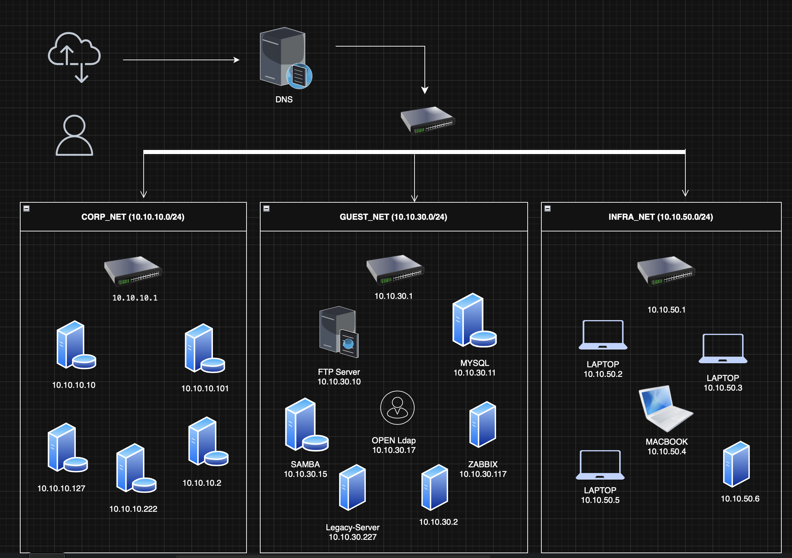

## Diagnóstico (Achados)

## Rede CORP_NET
- Identificado o switch IP 10.10.10.1, respondendo pela porta 111 TCP;
- Idenficado 05 servidores que não possuem portas abertas e que não foi possível identificar o sistema operacional e servicos ativos;

## Rede GUEST_NET
- Identificado o switch IP 10.10.30.1, respondendo pela porta 111 TCP;
- Foram encontrados 07 servidores:
- 06 servidores possuem portas abertas, sistema operacional e serviços identificáveis;
- 02 servidores não possuem portas abertas e não foi possível identificar o sistema operacional e serviços ativos

### Rede INFRA_NET
- Identificado o switch IP 10.10.50.1, respondendo pela porta 111 TCP;
- Foram encontrados 04 dispositivos que aparentam ser notebooks de usuários. Como a rede se chama INFRA_NET, acredito se tratar da subrede de gerência e os notebooks são do time de infra. Nenhum dos dispositivos apresenta portas abertas, e não foi possível identificar o sistema operacional e serviços ativos;
- Identificado 01 servidor que não possuem portas abertas e que não foi possível identificar o sistema operacional e serviços ativos;

## Recomendações

- Os servidores identificados na rede GUEST_NET, possuem serviços considerados critivos, como o servidor de Banco de dados, o servidor de LDAP e o de monitoramento "ZABBIX", além de um servidor com o nome de LEGACY-SERVER, que pode conter informações não publícas. Sugiro fortemente que estes servidores estejam em subredes privadas em uma rede não "GUEST", como o nome atual da rede sugere;

- Em todas as redes notam-se servidores com uptime de milhares de dias. É importante validar se todos os sistemas operacionais e serviços possuem as atualizações de segurança mais recentes;

## Plano de Ação (80/20)

| Ação                          | Impacto | Facilidade | Prioridade |
|-------------------------------|---------|------------|------------|
| Isolar servidores críticos    | Alto    | Média      | Alta       |
| Migrar de FTP para SFTP       | Médio   | Media      | Alta       |
| Atualização de SO             | Alto    | Baixa      | Alta       |
| Atualização de Serviços       | Medio   | Baixa      | Alta       |

## Conclusão

O trabado preliminar de identificação gerou resultados que pedem atenção imediata no quisito de segurança, como servidores e serviços com possível defazagem nos processos de atualização o que leva a riscos de invasão. É importante isolar servidores e serviços críticos como Bancos de Dados e Servidores de Monitoramento e de autenticação, por exporem dados da empresa, de usuários e da infraestrutura, os quais podem ser usados para causar prejuízos, para a empresa e para os seus clientes.
Seguem imagens do que foi encontrado e relatórios mais detalhados podem ser gerados para apoiar nas sugestões listadas.

# Anexos

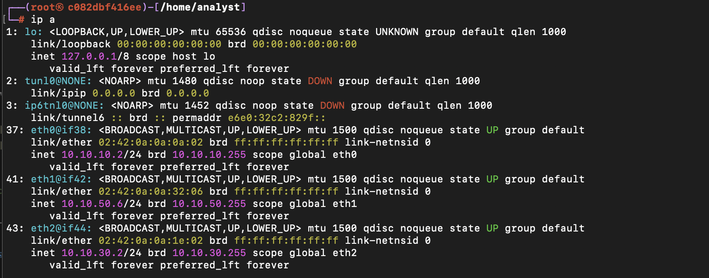

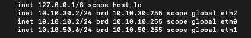

## Listas de hosts CORP NET
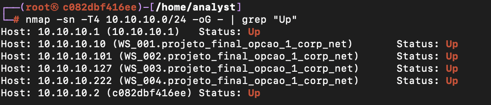
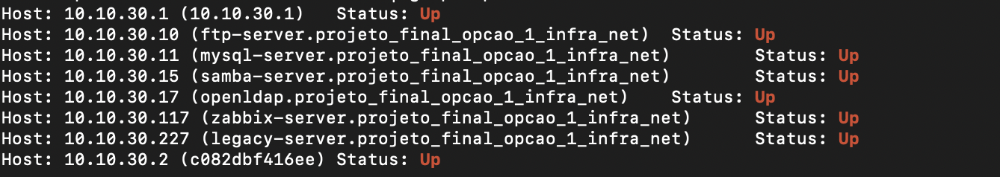
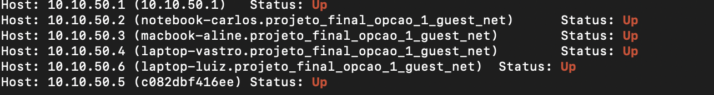

### Portas abertas
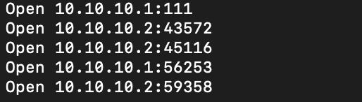
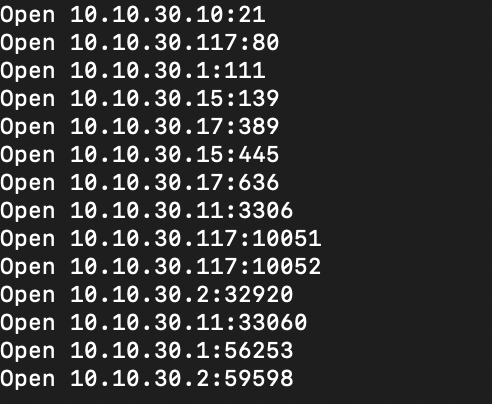
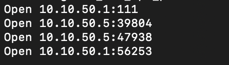

### Banco de dados MySQL
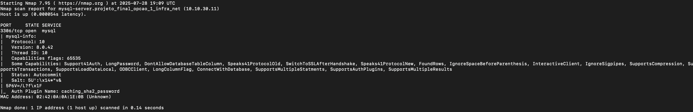

### LDAP
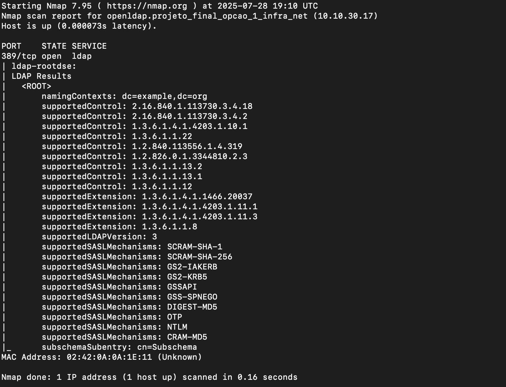

### WEB
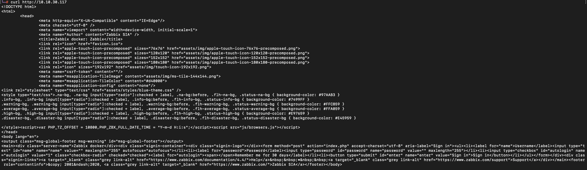

### Local de armazenamento dos dados capturados
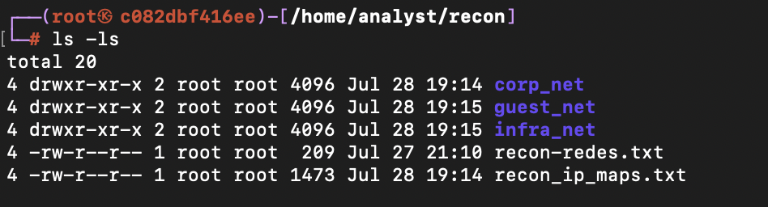